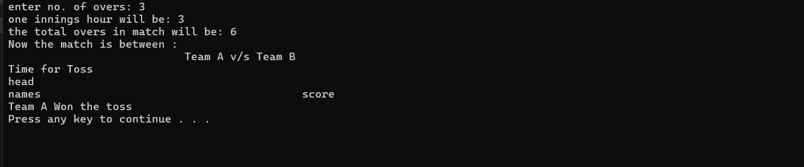
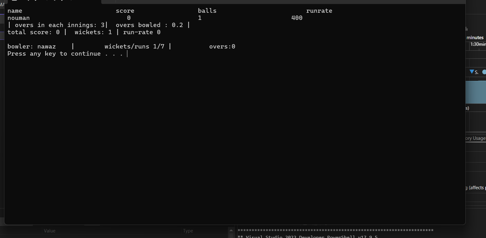
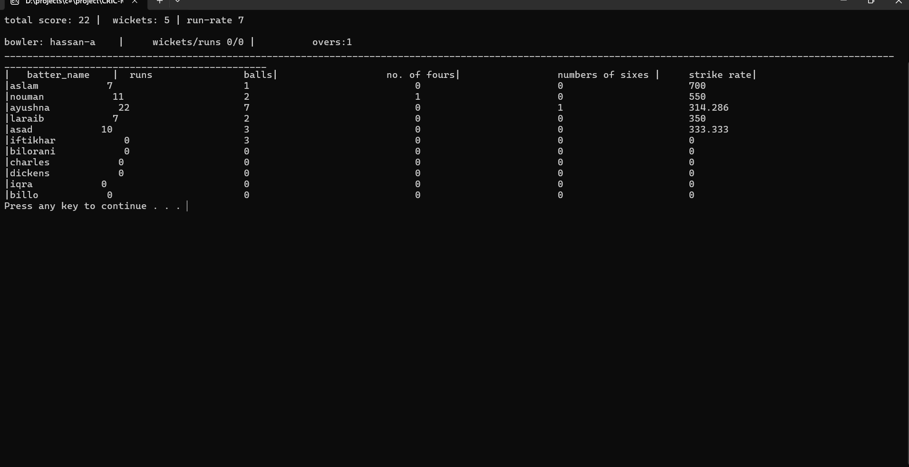
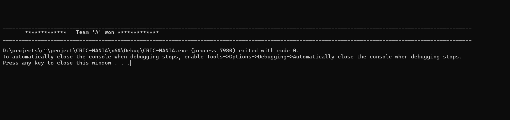

# CRIC-MANIA
 A simulator for cricket in c++ which is a simple console based project

# How It Works
 - just like a normal cricket game the game will start with asking the limit of the overs
 - then proceeds with toss which is randomized
 - Who evers wins the toss gets to bat first.
 - the score and wickets are purely randomized
 - each ball will be played and each time a random function for score will be called
 - after the overs are finished the second innings will begun
 - the second team will bat and chased the score
 - if they reached the same score its draw, if they reach the target they win
 - the inning can be over before the set of limited overs, if the batting team lost all of their wickets
# functionalities
 - for over limit, i have used file handling to read and store the overs
 - for bowling and batting team their information is stored in an array
# images

### OVERS n TOSS
 after choosing set of overs, its toss

### Score Card During Play
 after toss winner takes the bat

### Batter score Card
 after inning batting scorecard

### Bowler scoreboard
 after an inning is finished the bowler performance is depicted 

### Winner Card
 winner after two innings played

# How to Setup
 - clone this repository
 - Setup visual studio
 - run the sln file

#

